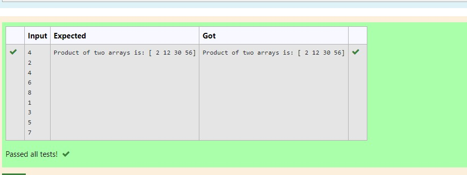

# Multiplying-two-matrix

## AIM:
To write the python program for Multiplying two matrices.

## ALGORITHM:

### Step 1:
Start the python program.

### Step 2:
Import numpy.create two null lists.

### Step 3:
Get two matrices from the user using append.

### Step 4:
Multiply the two matrices.

### Step 5:
Display the result.

## PROGRAM: 
Developed by :M.S.JEEVA
Reg no : 212221230040
```
import numpy as np
l1, l2 = [],[]
n= int(input())
for i in range(n):
    l1.append(int(input()))
for i in range(n):
    l2.append(int(input()))
value1= np.array(l1)
value2 = np.array(l2)
result = value1*value2
print("Product of two arrays is:",result)
```

## OUTPUT:


## RESULT:
Thus the  multiplication of matrix is done.


